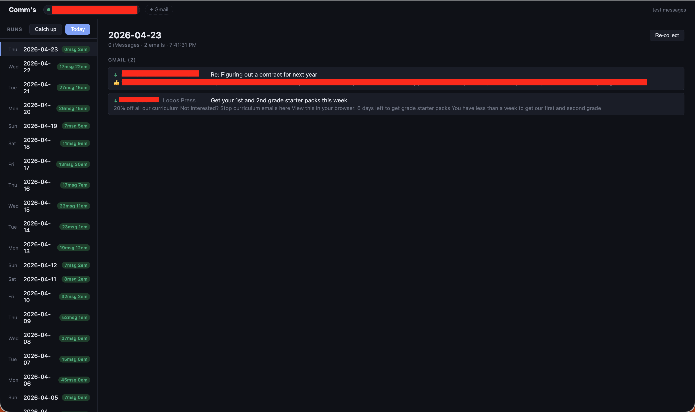

# Comms

Comms collects your iMessages and Gmail into a local SQLite database that your other personal apps can query. It runs as a lightweight background server on your Mac and exposes a dashboard for browsing history and triggering collection.

The point isn't the dashboard — it's the database. Once Comm's is running, any other app you build can open `~/Library/Application Support/comms/comms.db` read-only and query exactly who you talked to, about what, and when — without touching iCloud, Google's servers, or any third-party service.



---

## What it collects

| Source | What's stored | What's skipped |
|--------|--------------|----------------|
| iMessages | Full message text, sender name, contact, timestamp | Attachments with no text, reactions/tapbacks |
| Gmail | Sender, subject, snippet (first ~150 chars) | Full email bodies, newsletters, automated mail |

Contact names are resolved locally from your macOS Contacts — phone numbers and Apple IDs are looked up in AddressBook before anything is stored. Only emails from real people (i.e. contacts you have, or addresses that don't look automated) are kept.

Nothing leaves your machine.

---

## The database

**`~/Library/Application Support/comms/comms.db`** — SQLite, WAL mode, safe to open read-only from any other process.

```sql
-- One row per collection run (one per day)
runs(id, date, collected_at, status, messages_count, emails_count, error)

-- Individual iMessages with full text
messages(id, run_id, date, contact, handle_id, direction, sender, text, sent_at)

-- Gmail metadata (no full bodies)
emails(id, run_id, date, direction, contact, email_address, subject, snippet, account)

-- Connected Gmail accounts (OAuth tokens, stored locally)
gmail_accounts(id, email, token_json, added_at)
```

Example query from another app:

```js
const Database = require('better-sqlite3');
const db = new Database(
  require('os').homedir() + '/Library/Application Support/comms/comms.db',
  { readonly: true }
);

// Everyone I texted this week
const contacts = db.prepare(`
  SELECT contact, COUNT(*) AS messages
  FROM messages
  WHERE date >= date('now', '-7 days')
  GROUP BY contact
  ORDER BY messages DESC
`).all();
```

---

## Requirements

- **macOS** — uses macOS-specific databases for iMessages and Contacts
- **Node.js** 18+
- **Full Disk Access** for your terminal app (to read iMessages)
- **Google OAuth credentials** (only if you want Gmail — optional)

---

## Setup

### 1. Clone and install

```bash
git clone https://github.com/nathan0colestock-code/comms.git
cd comms
npm install
```

### 2. Configure

```bash
cp .env.example .env
```

Generate an API key and fill in the Gmail credentials:

```bash
openssl rand -hex 32   # paste result as API_KEY
```

For Gmail, fill in `GOOGLE_CLIENT_ID` and `GOOGLE_CLIENT_SECRET`:

1. Go to [console.cloud.google.com](https://console.cloud.google.com)
2. **APIs & Services → Credentials → Create OAuth 2.0 Client ID**
3. Application type: **Web application**
4. Add `http://localhost:3748/api/gmail/callback` as an authorized redirect URI
5. Copy the client ID and secret into `.env`

If you don't want Gmail, leave those fields blank — iMessages will still work.

### 3. Grant Full Disk Access (required for iMessages)

**System Settings → Privacy & Security → Full Disk Access** — add your terminal app (Terminal, iTerm2, etc.).

> If you run the server from inside another app (VS Code, an IDE, etc.), grant Full Disk Access to that app instead — the permission applies to whichever process launches `node`.

### 4. Start the server

```bash
npm start
```

Dashboard opens at **[http://localhost:3748](http://localhost:3748)**.

### 5. Connect Gmail (optional)

Click **+ Gmail** in the dashboard header and complete the OAuth flow. If Google shows an "app not verified" warning screen, click **Advanced → Go to app (unsafe)** — this is expected for OAuth apps you've created yourself that haven't gone through Google's verification process.

### 6. Collect

- **Today** button — collects today's messages and emails right now
- **Catch up** button — collects every day since the last successful run, sequentially
- **CLI**: `node collect.js 2026-04-15` — collect a specific date

For automated daily collection, add a cron job or launchd agent that runs `node collect.js` once per night.

---

## Integration API

The server exposes a REST API for other apps. It runs locally on port 3748 and is also tunneled to a stable public HTTPS URL via ngrok so deployed apps can reach it.

```
GET  /api/runs                          — list recent runs (last 60 days)
GET  /api/runs/:date                    — full detail for a date (messages + emails)
POST /api/collect/:date                 — trigger collection for a specific date
GET  /api/gmail/accounts                — list connected Gmail accounts (no tokens)
GET  /api/status                        — suite-standard status envelope
GET  /api/contacts/:name                — full contact profile + timeline
POST /api/contacts/:name/draft-message  — build an outbound Gmail draft tailored
                                          to this contact's history (never sends)
POST /api/gloss/contacts                — gloss → comms contact push
GET  /api/email-helper/runs             — recent inbox-triage runs
GET  /api/email-helper/unsubscribes     — pending unsubscribe review queue
POST /api/email-helper/unsubscribes/:id/{approve,dismiss}
POST /api/email-helper/run              — manually trigger the triage job
GET  /api/people/review/next?skip=N     — next person in the review queue
POST /api/people/review/:id/reviewed    — mark reviewed
GET  /api/people/review/due?days=N      — count of people due for review
```

## What it collects (continued)

| Source | What's stored | What's skipped |
|--------|--------------|----------------|
| **macOS call history** | Call timestamp, direction (incoming/outgoing/missed), duration, resolved contact name, phone | Call recordings |

Phone call history is ingested read-only from `~/Library/Application Support/CallHistoryDB/CallHistory.storedata` (requires Full Disk Access permission once). Calls appear in each contact's unified timeline alongside messages and emails.

## People review

An on-demand flashcard mode for keeping relationships warm. Click **Start review** in the contacts sidebar — comms picks the person you've gone longest without reviewing (biased toward priority ≥ 1 people and active relationships) and shows everything it knows about them on one card: last contact, profile, gloss notes, upcoming dates, recent timeline. Use **Next** to mark reviewed + advance, **Skip** to pass without spending the review, **End** to close. Keyboard: → / ← / Esc. A counter in the sidebar shows how many people haven't been reviewed in 30+ days — no push notifications.

### Scheduled inbox triage

Comms runs an inbox-triage job at **08:00 and 12:00 local** (hours configurable via `EMAIL_HELPER_HOURS`). For each unread thread:

- **transactional** (receipts, no-reply, 2FA) → leave alone
- **newsletter / bulk** (List-Unsubscribe header + bulk-sender pattern) → queue the unsubscribe URL for human review; optionally archive if `AUTO_ARCHIVE_BULK=true`
- **real person** → draft a context-aware reply into Gmail Drafts. Never sends.

The classifier is pure heuristic — free and deterministic. Unsubscribes never auto-click; they accumulate in `email_unsub_queue` for weekly batch review.

### MCP tools

`mcp.js` exposes comms as an MCP server so Claude (or any MCP client) can query contacts, draft messages, and read nudges directly. See `mcp.js` for the tool list.

All `/api/*` routes require an API key — pass it as a header:

```
Authorization: Bearer <API_KEY>
```

or

```
X-API-Key: <API_KEY>
```

The key lives in `.env` as `API_KEY`. Generate one with:

```bash
openssl rand -hex 32
```

### Local access

```js
const res = await fetch('http://localhost:3748/api/runs/2026-04-22', {
  headers: { 'Authorization': `Bearer ${process.env.COMMS_API_KEY}` }
});
const { messages, emails } = await res.json();
```

### Remote access (deployed apps)

The tunnel runs automatically at login via a launchd agent. Call the public URL from any deployed app:

```js
const res = await fetch('https://<your-ngrok-static-domain>/api/runs/2026-04-22', {
  headers: { 'Authorization': `Bearer ${process.env.COMMS_API_KEY}` }
});
const { messages, emails } = await res.json();
```

### Running the tunnel

The ngrok tunnel and comms server are both registered as launchd agents and start automatically at login. To manage them manually:

```bash
# Start
launchctl load ~/Library/LaunchAgents/com.comms.server.plist
launchctl load ~/Library/LaunchAgents/com.comms.ngrok.plist

# Stop
launchctl unload ~/Library/LaunchAgents/com.comms.server.plist
launchctl unload ~/Library/LaunchAgents/com.comms.ngrok.plist

# Logs
tail -f /tmp/comms-server.log
tail -f /tmp/ngrok-comms.log
```

---

## Tests

```bash
npm test
```

Runs 42 tests across three files using Node's built-in test runner (no extra dependencies):

- `test/unit.test.js` — pure functions: phone normalisation, email filtering, contact parsing, NSTypedStream decoding
- `test/db.test.js` — database schema, runs/accounts CRUD against a temp SQLite file
- `test/api.test.js` — HTTP auth middleware and route responses against an in-process server

---

## Installing as background services

Run once after cloning to register launchd agents that start the server (and the ngrok tunnel, if configured) automatically at login:

```bash
bash install.sh
```

The script detects your Node path (including nvm/volta installs), generates the correct plist files for your machine, and loads them immediately. Re-run it whenever you update Node or move the repo.

---

## Setting up with Claude Code

If you have [Claude Code](https://claude.ai/code) installed, paste this prompt to have it walk you through the full setup interactively:

```
I want to set up Comm's — a local iMessage + Gmail aggregator. Read README.md in the current directory, then guide me through the following steps, checking each one before moving to the next:

1. Run `npm install` if node_modules is missing.
2. Check for `.env` — if missing, copy from `.env.example`, then generate an API_KEY with `openssl rand -hex 32` and write it in.
3. Test iMessage access: run `node -e "require('better-sqlite3')(require('os').homedir()+'/Library/Messages/chat.db',{readonly:true}).close();console.log('ok')"` — if it fails, tell me exactly what to enable in System Settings and wait for me to confirm before continuing.
4. Start the server briefly (`node server.js &`), confirm it's listening on port 3748, then stop it.
5. Ask if I want Gmail integration. If yes, walk me through creating Google OAuth credentials and connecting an account via the dashboard.
6. Ask if I want a public HTTPS tunnel via ngrok. If yes, help me install ngrok, create a free account, get my authtoken and static domain, and configure the ngrok.yml.
7. Run `bash install.sh` to register everything as launchd services.
8. Run `npm test` and confirm all tests pass.
9. Do a test collection: `node collect.js` (defaults to yesterday) and show me the output.
```

---

## Privacy

- **iMessages**: text is stored in your local SQLite file only — nothing is transmitted anywhere
- **Gmail**: only metadata is fetched (sender, subject, snippet). Full message bodies are never requested or stored
- **Contacts**: resolved locally from your macOS AddressBook — no external API calls
- **No AI, no cloud, no analytics** — the server has no outbound connections except to the Gmail API when you've connected an account

---

## Suite siblings

Comm's is the **messaging + contacts** node of a five-app personal suite. The apps are independent processes that talk over HTTP with Bearer auth; each runs on [Fly.io](https://fly.io) and backs up SQLite to Cloudflare R2 via [Litestream](https://litestream.io).

| App | Role | What flows to/from Comm's |
|---|---|---|
| **[gloss](https://github.com/nathan0colestock-code/gloss)** | Personal knowledge graph (paper-journal OCR, pages, collections, people) | Gloss pushes contact profiles into Comm's via `POST /api/gloss/contacts` |
| **[scribe](https://github.com/nathan0colestock-code/scribe)** | Collaborative document editor | Doesn't talk to Comm's directly; shares contacts indirectly via gloss |
| **[black](https://github.com/nathan0colestock-code/black)** | Personal file search (Drive, Evernote, iCloud → indexed) | Black can reference contact data from Comm's for enrichment |
| **[maestro](https://github.com/nathan0colestock-code/maestro)** | Overnight orchestration (capture → worker → test → merge → deploy) | Maestro polls `GET /api/status` to show fleet health; can dispatch feature sets that touch Comm's |

All five apps expose a suite-standard `GET /api/status` that returns `{ app, version, ok, uptime_seconds, metrics }`, protected by Bearer auth using either the app's own `API_KEY` or a shared `SUITE_API_KEY`.

Integration contracts between pairs of apps live in `docs/INTEGRATIONS/` in the primary repo for each contract.

